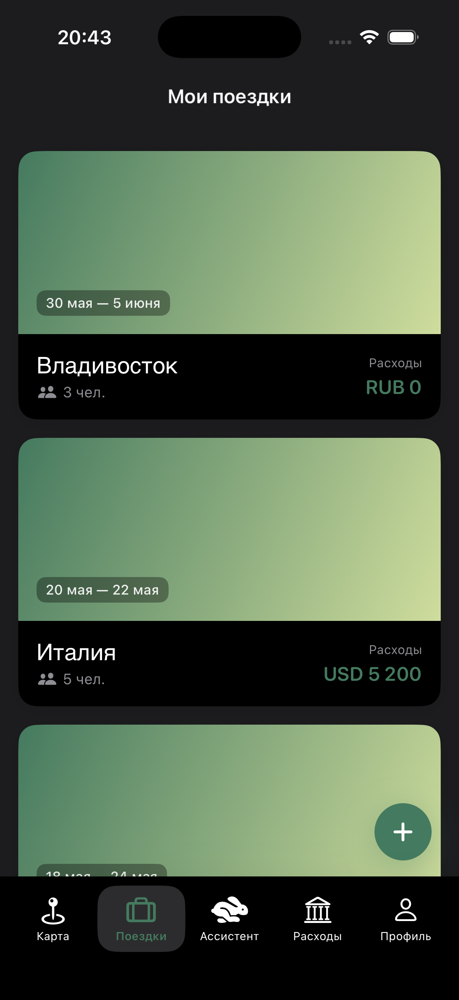
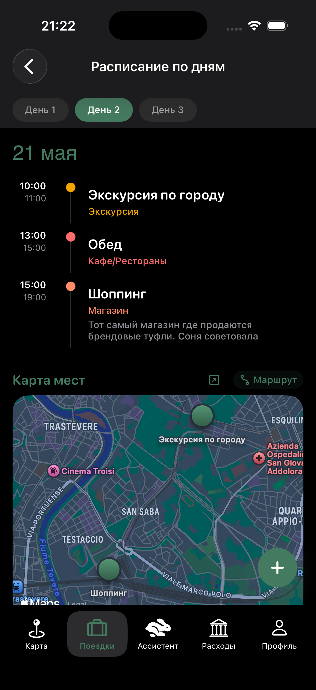
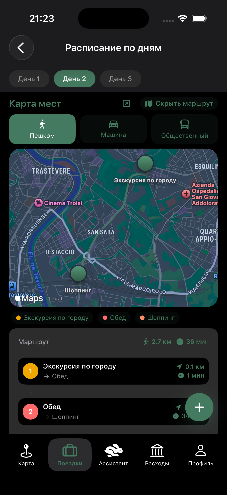
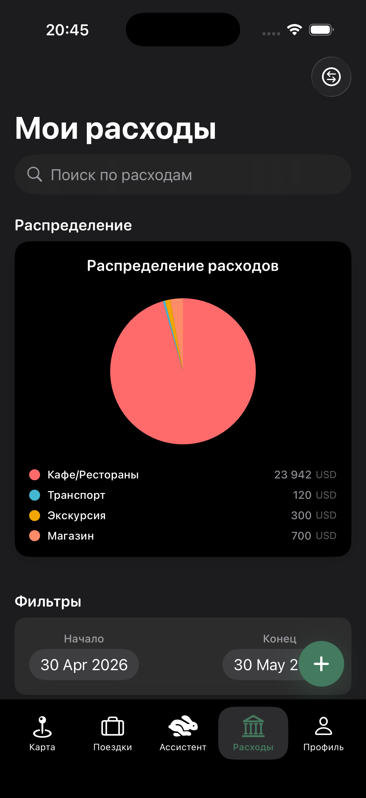
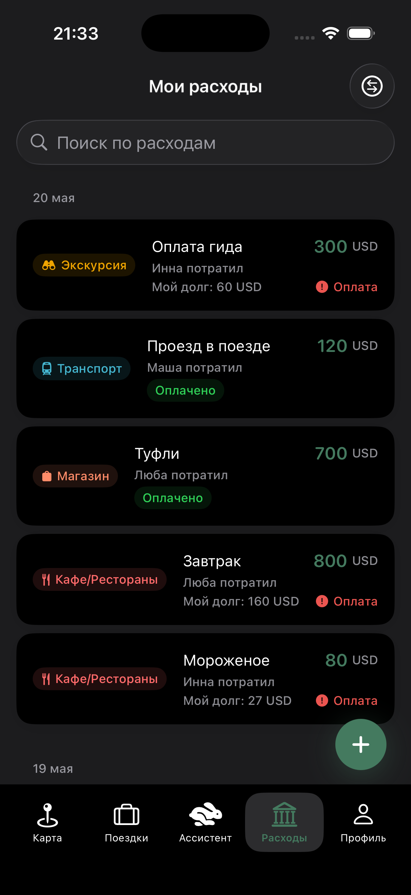
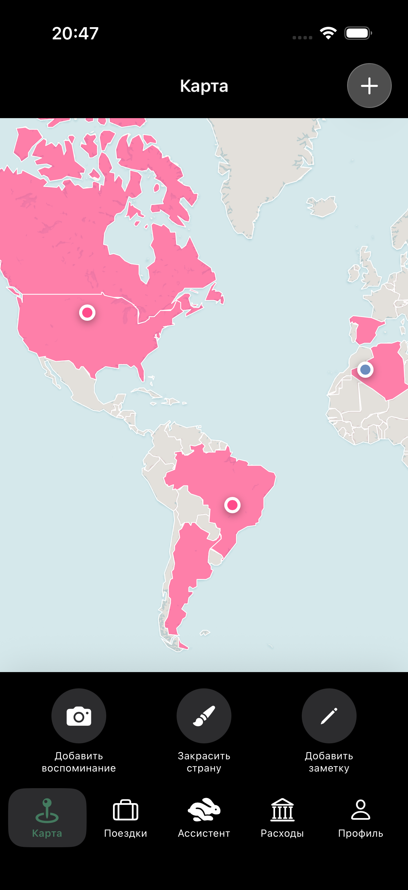
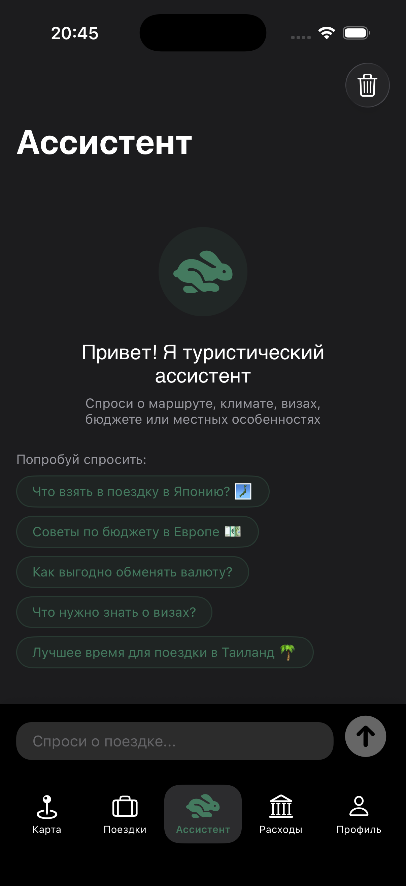
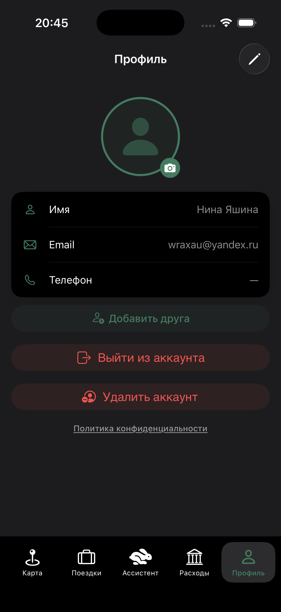

# Escape Plan — iOS-приложение для планирования путешествий

Escape Plan — приложение для организации поездок в компании. Расписание по дням, общий бюджет, карта воспоминаний и ассистент — всё в одном месте.

## Ссылка на приложение в AppStore - https://apps.apple.com/ru/app/escape-plan/id6770517894?l=en-GB
--
### Ссылка на Figma - https://www.figma.com/design/T0vhCfXZKBUkutnLA0Ov2K/Escape-Plan?node-id=2-4&t=PMWAvu7CuhoMe3WZ-1

---

## Мои поездки

Здесь находятся карточки поездок, внутри содержится вся необходимая информация о путешествии. Можно вести несколько поездок одновременно: одна в процессе, другая уже запланирована на лето, третья — в качестве черновика. Новая поездка создаётся быстро: нужно указать название, даты, валюту и пригласить участников.

 

---

## Расписание по дням

Внутри каждой поездки есть расписание, разбитое по дням. На каждый день добавляются активности с временем, категорией, местом и заметками. Все точки отображаются на встроенной карте — можно сразу построить маршрут пешком, на машине или общественным транспортом.

 

---

## Расходы и долги

Здесь ведётся учёт всех трат в поездке. Каждый расход помечается как общий или личный, указывается кто платил и между кем делится сумма. Долги между участниками считаются автоматически. График показывает на что ушли деньги по категориям: кафе, транспорт, экскурсии, покупки.

 

В списке расходов отображается каждая трата: дата, сумма, категория, кто заплатил и текущий статус долга. Когда долг возвращён — статус обновляется для всех участников поездки. Есть поиск по названию и фильтр по датам.

 

---

## Карта воспоминаний

Отдельный экран, где можно отмечать страны, в которых уже побывал, закрашивая их на карте мира. К конкретным местам добавляются фотографии и заметки — получается личный дневник путешествий.

 

---

## Ассистент

Встроенный чат для вопросов о поездке. Можно спросить про визы, погоду в конкретный месяц, что посмотреть, как добраться или какой бюджет заложить. Отвечает на языке вопроса.

 

---

## Профиль

Здесь хранятся имя, email и фото профиля. Можно добавить друзей по email, чтобы быстро приглашать их в новые поездки. Аккаунт удаляется прямо из приложения.

 

---

*Скоро в App Store*
